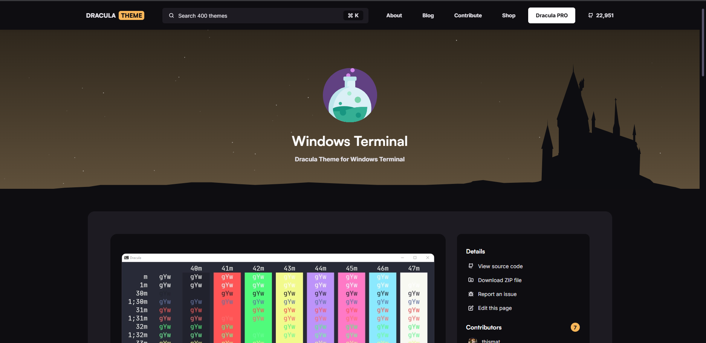
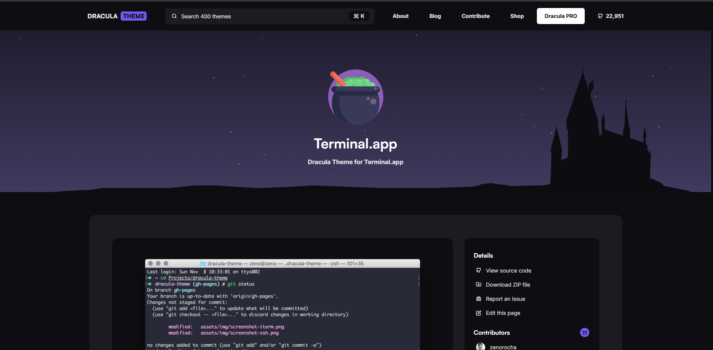

# Pimp Your Terminal

show note from youtube video ->


## Change to Dracula Theam

Go to Dracula Theam Webnsite And Follow The Instructions to match the terminal 

<div style="display: flex; gap: 10px; flex-wrap: wrap;">
  
  
  <!-- add more images as needed -->
</div>

#### Install ZSH

```bash
sudo apt install zsh
```

##### Set zsh as default

```bash
chsh -s $(which zsh)`
```

##### in gnome terminal

> **profile custom command**

##### zsh default themes

```bash
https://github.com/ohmyzsh/ohmyzsh/wiki/Themes
```

edit `.zshrc` file 

```bash
nano .zshrc
```

#### Edit The Theam for Your Liking 

```bash
ZSH_THEME="jonathan"
```

##### Install ohmyzsh

```bash
sh -c "$(curl -fsSL https://raw.githubusercontent.com/ohmyzsh/ohmyzsh/master/tools/install.sh)"`
```

##### Zsh Must-Have Plugin

```bash
git clone https://github.com/zsh-users/zsh-autosuggestions.git $ZSH_CUSTOM/plugins/zsh-autosuggestions`
```

```bash
git clone https://github.com/zsh-users/zsh-syntax-highlighting.git $ZSH_CUSTOM/plugins/zsh-syntax-highlighting`
```

#### Edit the `.zshrc` file to include plugins

```bash
plugins=(git zsh-autosuggestions zsh-syntax-highlighting)
```

##### You can Find plugins that include with ohmyzsh

```bash
https://github.com/ohmyzsh/ohmyzsh/wiki/Plugins
```

##### Download Nerd Fonts 
[Nerd Font Website](https://www.nerdfonts.com/)
[Nerd Font Git-Hub](https://github.com/ryanoasis/nerd-fonts/tree/master/patched-fonts/FiraMono)

download and install firamono for linux

##### Install Powerlevel 10k

```bash
git clone https://github.com/romkatv/powerlevel10k.git $ZSH_CUSTOM/themes/powerlevel10k`
```

#### Edit `.zshrc` File to add the theam

```bash
ZSH_THEME="powerlevel10k/powerlevel10k"
```

```bash
POWERLEVEL9K_MODE="nerdfont-complete"
```
